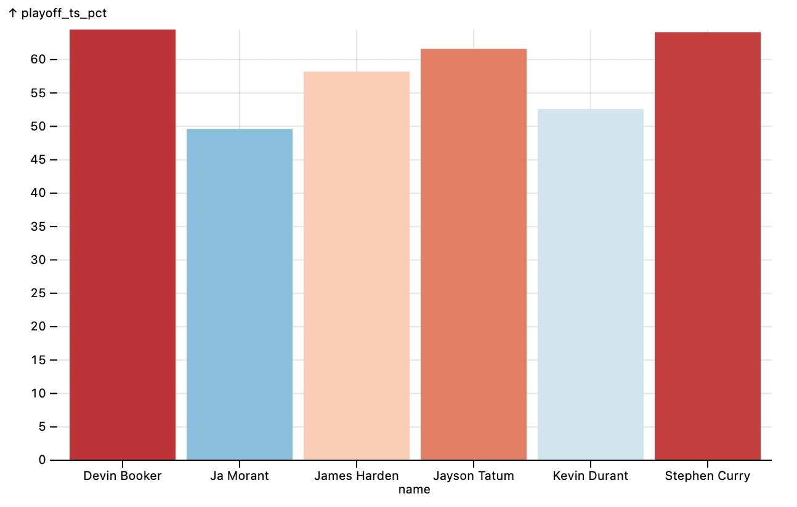

# Typescript Observable plot template

This template repository gets you started with a very simple bar chart that looks like this:

The chart isn't much, but this repository's main job is to set up a typescript environment so that you can start hacking on your graph without any hassle.

## Instructions

1. Clone this repo
2. `npm install`
3. `make serve`

If everything worked, a tab should open on your browser to a web page showing an observable plot bar chart after you complete the last step.

## Prerequisites

- a modern nodejs environment
- gnu make

## Make tasks

I use `make` tasks instead of `npm run` commands because tsc builds can get quite slow once your file gets larger.

This repo has three targets you'll want to use:

- `make all`: build the production file and save it to `dist/index.js`
- `make serve`: serve `index.html` on port `8080` and turn on esbuild's watch mode to rebuild your js file as you change `index.ts`
- `make ci`: run eslint. There's a github action that runs this task for you on pushes

## Tools

- tsc for typechecking
- esbuild for compilation
- eslint for linting
- prettier for formatting
- make for running tasks and managing compilation
- github actions for running lint on code changes
- http-server for serving the site in development
- d3 is imported by observable plot
  - don't import another version unless you need it!

## Observable Plot Documentation

- https://observablehq.com/@observablehq/plot
- https://github.com/observablehq/plot
- https://observablehq.com/@observablehq/plot-cheatsheets?collection=@observablehq/plot-cheatsheets
